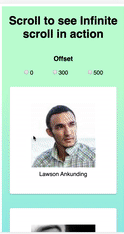

# react-infinite-scroll 📜

### A dead simple React infinite-scroll</h3>

<p align="center">
    
    
    
  </p>

<p align="center"></p>

#### ✅ Built on new flashy Reactjs hooks.

#### ✅ No assumption on the how you bring data, just wrap the content inside the InfiniteScroll component

#### ✅ Uses Intersection Observer API, hence performant than regular ways of doing it

#### ✅ Completely configurable. Can be used to trigger infinite scroll in any direction.

#### ✅ Takes care of screen resizing

#### ✅ Tiny (1.4kb gzipped)

### Installing

If using npm:

```sh

npm i @simbathesailor/react-infinite-scroll --save

```

If using yarn:

```sh

yarn add @simbathesailor/react-infinite-scroll

```

## Demo

[Demo App](https://7phl3.csb.app/)

[Full Codesandbox Code](https://codesandbox.io/s/useintersectionobserver-7phl3)

## Usage

### Scenario: When need to fetch new set of data when scroll end is reached

```jsx
import { InfiniteScroll } from '@simbathesailor/react-infinite-scroll';

function App() {
  // setting up the active page fetched, It can be any logic needed

  const [activePageInfo, setActivePageInfo] = React.useState(1);

  // This is data recieved till now, which will be rendered.

  const [dataInfiniteScroll, setDataInfiniteScroll] = React.useState(null);

  // Logic to execute to get the initial set of results

  // On mount of the component , we are making an API call to get

  // the initial set of results.

  React.useEffect(() => {
    fetch(
      `https://5da9aa08de10b40014f3745c.mockapi.io/api/v1/feed?page=1&limit=10`
    )
      .then(res => {
        return res.json();
      })

      .then(data => {
        setDataInfiniteScroll(data);
      });
  }, []);

  // Logic to execute when the reached the end of the scroll

  // This is a callback which can be passed to InfiniteScroll component, The callback

  // will recieve the isVisible value as true when we reach the end of the scroll.

  const callbackForInfiniteScroll = React.useCallback(
    isVisible => {
      let activePage;

      setActivePageInfo(c => {
        activePage = c;

        return c;
      });

      if (isVisible) {
        fetch(
          `https://5da9aa08de10b40014f3745c.mockapi.io/api/v1/feed?page=${activePage +
            1}&limit=10`
        )
          .then(res => {
            return res.json();
          })

          .then(data => {
            setDataInfiniteScroll(dataInState => [...dataInState, ...data]);

            setActivePageInfo(c => c + 1);
          });
      }
    },

    [setActivePageInfo]
  );

  return (
    <div className="App">
      {/* Just need to pass the callback to invoke, when list reaches end */}

      <InfiniteScroll callback={callbackForInfiniteScroll}>
        {dataInfiniteScroll &&
          dataInfiniteScroll.map(elem => {
            /** Box is not a React element. It's a React component **/

            return <Box key={elem.id} {...elem} />;
          })}
      </InfiniteScroll>
    </div>
  );
}

// It is important to use forwardRef when Components are not React Elements.

// InfiniteScroll component takes the responsibility of initiliazing

// the intersection observer for you. ref should resolve to a DOM element

const Box = React.forwardRef((props, ref) => {
  const { avatar, id, name } = props;

  return (
    <div ref={ref} className="box-item">
      

      <span>{name}</span>
    </div>
  );
});
```

### Scenario: When need to fetch new set of data with some offset at bottom of the page.

Let' see only the changed code from above. Infinite scroll takes rootMargin as one of the option similar to intersection observer API. Hence any offset can be given as:

rootMargin: "[topOffset], [rightOffset], [bottomOffset], [leftOffset]". Let's see the one of the example having a bottom offset of 680px.

```jsx
<div className="App">
  <h1>Scroll to see Infinite scroll in action</h1>

  {/* Just need to pass the callback to invoke, when list reaches end */}

  <InfiniteScroll
    callback={callbackForInfiniteScroll}
    options={{
      rootMargin: `0px 0px 680px 0px`,
    }}
  >
    {dataInfiniteScroll &&
      dataInfiniteScroll.map(elem => {
        return <Box key={elem.id} {...elem} />;
      })}
  </InfiniteScroll>
</div>
```

We can also give , top offset, left offset and right offset. So Infinite scroll can be done in any direction. This also support infinite scrolls in scrollable areas apart from viewport. \*Need to test more on that.

## Props

| Props              | IsMandatory | Type                                                                    | Default                                                                                                     | Description                                                                                                                                                                                |
| ------------------ | ----------- | ----------------------------------------------------------------------- | ----------------------------------------------------------------------------------------------------------- | ------------------------------------------------------------------------------------------------------------------------------------------------------------------------------------------ |
| callback           | Yes         | (isVisibile) => {<br> // Logic to trigger <br> // next set of data<br>} |                                                                                                             | A callback from consumer,<br>which gets isVisible boolean<br>as the argument.                                                                                                              |
| options            | No          | object                                                                  | {<br>rootMargin: '0px 0px 0px 0px'<br>threshold: '0, 1'<br>when: true<br>visibilityCondition: Function<br>} | These are the almost same options,<br>which we pass to intersectionObserver<br>except threshold which is changed to string type.<br>Done for avoiding extra check for array<br>comparison. |
| whenInfiniteScroll | No          | boolean                                                                 | true                                                                                                        | The flag which can be used to stop<br>infinitescroll behaviour, when false.<br>can be used to off when , data is no<br>more to be fetched.                                                 |
| LoadMoreComponent  | No          | React.ReactElement                                                      | Loading More...                                                                                             | This is a ReactElement or React Component<br>which is shown when scroll reaches end                                                                                                        |

## Concept

react-infinite-scroll is using **Intersection Observer API**. Hence very performant and slick. We can pass almost same options we pass for setting up intersection observer. Here is the link for [MDN Intersection observer](https://developer.mozilla.org/en-US/docs/Web/API/Intersection_Observer_API#root-intersection-rectangle). You can read about it and understand why it is performant.

The InfiniteScroll Component make use of useInfiniteScroll and useIntersectionObserver hook. React version above >16.8.6 can use this component for infinite scrolling.

Plan is to bundle useIntersectionObserver as a separate package later.

## Work to do

- TestCases.

- Other examples

- Update readme with all the props InfiniteScroll component takes as a table.

- Example how to stop the infinite scroll and sending the custom components as Loader.

## Contributing

Please read [CONTRIBUTING.md](CONTRIBUTING.md) for details on our code of conduct, and the process for submitting pull requests to us.

## Versioning

We use [SemVer](http://semver.org/) for versioning. For the versions available, see the [tags on this repository](https://github.com/your/project/tags).

## Authors

[simbathesailor](https://github.com/simbathesailor)

See also the list of [contributors](https://github.com/your/project/contributors) who participated in this project.

## License

This project is licensed under the MIT License - see the [LICENSE.md](LICENSE.md) file for details

## Contributors

Thanks goes to these wonderful people ([emoji key](https://github.com/all-contributors/all-contributors#emoji-key)):

<table><tr><td  align="center"><a  href="https://github.com/simbathesailor"><br /><sub><b>Anil kumar Chaudhary</b></sub></a><br /><a  href="https://github.com/simbathesailor/react-infinite-scroll/commits?author=simbathesailor"  title="Code">💻</a>  <a  href="#ideas-simbathesailor"  title="Ideas, Planning, & Feedback">🤔</a>  <a  href="#design-simbathesailor"  title="Design">🎨</a>  <a  href="https://github.com/simbathesailor/react-infinite-scroll/commits?author=simbathesailor"  title="Documentation">📖</a>  <a  href="https://github.com/simbathesailor/react-infinite-scroll/issues/created_by/simbathesailor"  title="Bug reports">🐛</a></td></tr></table>
